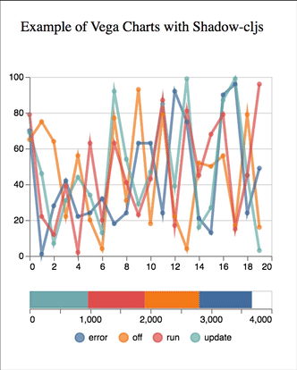

# Vega Charts for Shadow-cljs projects

`[org.clojars.baader/vega-charts "0.3.0"]`

I had issues to integrate to a large project the OZ dependency (but I can't solve the dependency hell..). 
Therefore I extracted the important part of the code and created that little library for us for Shadow-cljs projects.
* **Rights to Metasoarous' OZ lib.**   Data visualizations in Clojure and ClojureScript using Vega and Vega-lite

1. No issues with CLJSJS dependencies (OZ)
2. Works with any versions of Vega
3. Few lines 

## Usage
Clone the demo from example folder!

Add to shadow-cljs.edn dependencies:  
 `  "vega": "^5.7.2",` 
    `"vega-lite": "^3.4.0",` >> same as in the vega spec shema! 
    `"vega-embed": "^4.2.2",` 
    `"vega-tooltip": "^0.18.1"`  

Add to dependencies
 
`[org.clojars.baader/vega-charts "0.3.0"]`

Requirements to Clojurescript file 
`[vega-charts.vega :as vega]`

Add into reagent part to application 
`[vega/vega-lite @data-spec]`

That's all!

# shadowcljs-npx-saas-watcher
